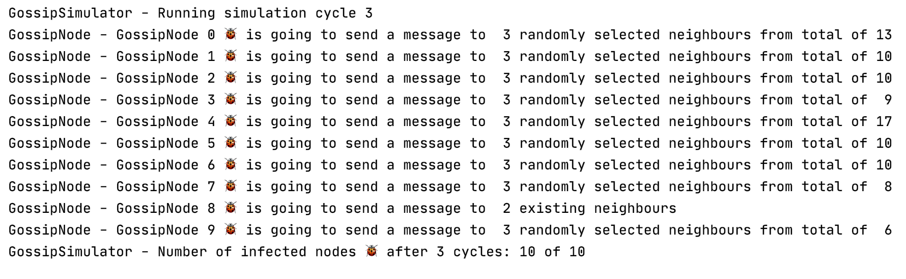

# Java Gossip Protocol Simulator API   

An experimental Java API to enable simulating the dissemination of data
across nodes (Hosts) in a network using the [Gossip epidemic protocol](https://en.wikipedia.org/wiki/Gossip_protocol).

The API enables running the simulation using a single computer.
Every node is represented by a [Plain Old Java Object](https://en.wikipedia.org/wiki/Plain_old_Java_object) `GossipNode`.
Therefore, since this is a simulation API, there is no actual
network communication, not even in localhost.

## 1. Examples

The figure below shows an example of the output for a simulation cycle,
where nodes send a message to their neighbors.
An infected node 🐞 is that one which has already received a message,
otherwise it's a non-infected node 💚.

A complete [example is available here](src/main/java/com/manoelcampos/gossipsimulator/examples/GossipSimulatorExample1.java).

## 2. Links

If you want to understand how the Gossip Protocol works, check this
nice [online graphical simulator](https://flopezluis.github.io/gossip-simulator/).
